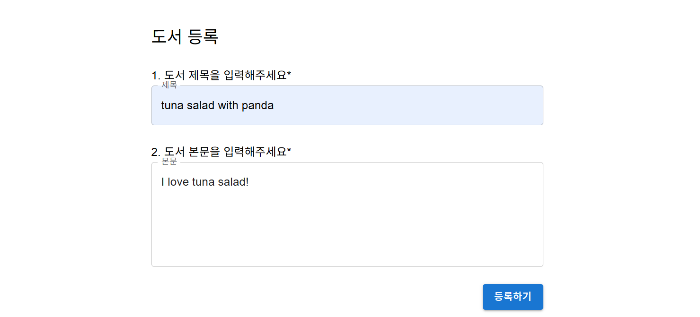
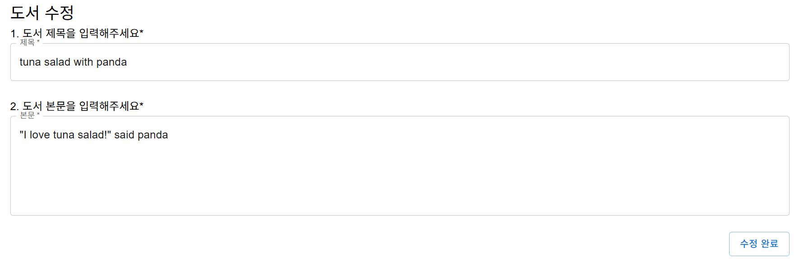

# FrontEnd
KT AIVLE Team 12 FrontEnd Team

📚 도서관리서비스

React + Vite + MUI 프론트엔드와 Spring Boot 백엔드로 구현한 **도서 관리 서비스**  
- CRUD·표지 생성(OpenAI DALL·E)·MUI 컴포넌트·Axios API 통신
- “📝 notepad” 스타일 카드 위에 표지 이미지를 오버레이 하는 UI

---

## 🔧 OpenAI API 연동 안내

OpenAI 기반 표지 이미지를 생성하기 위해,  
`book_frontEnd/src/pages/BookCoverPage.jsx` 파일에 아래와 같이 API 키를 작성합니다.

```javascript
import { useEffect, useState } from 'react';
import { useParams, useNavigate } from 'react-router-dom';
import { getBookById } from '../api/bookApi';
import { Container, Typography, Button, CircularProgress } from '@mui/material';
import axios from 'axios';

export default function BookCoverPage() {
        const { id } = useParams();
        const navigate = useNavigate();
        const [cover, setCover] = useState(null);
        const [loading, setLoading] = useState(true);

        const openaiApiKey = "YOUR_OPENAI_API_KEY"; // <-- 개인 API 키 입력
    }
```


---

## 🛠️ 초기 프로젝트 세팅 가이드

로컬 환경에서 프로젝트를 처음 시작할 때 필요한 설치 명령어 모음입니다.  


0️⃣ Node.js 버전 확인
```bash
node -v  # 버전 확인 (v18 이상 권장, v20도 OK)
```


1️⃣ Vite 프로젝트 생성

- npm 사용 시:
```bash
npm create vite@latest book_frontEnd -- --template react
```

- yarn 사용 시:
```bash
yarn create vite book_frontEnd --template react
```


2️⃣ 프로젝트 폴더 이동 및 의존성 설치
```bash
cd book_frontEnd
npm install
```

그 후, 개발 서버 실행:
```bash
npm run dev  # Vite 개발 서버 실행
```


3️⃣ MUI(Core + Icons) 설치
```bash
npm install @mui/material @emotion/react @emotion/styled @mui/icons-material
```


4️⃣ Axios, React Router 설치
```bash
npm install axios react-router-dom
```

---


## 🚀 Features
| 페이지 | 경로 | 주요 기능 |
|--------|------|-----------|
| 📗 [**BookListPage**](https://github.com/AIVLE-MINI-PROJECT-TEAM12/FrontEnd/blob/main/book_frontEnd/src/pages/BookListPage.jsx) | `/books` | 사용자 도서 목록 조회, 테이블 정렬/검색 |
| 📘 [**BookDetailPage**](https://github.com/AIVLE-MINI-PROJECT-TEAM12/FrontEnd/blob/main/book_frontEnd/src/pages/BookDetailPage.jsx) | `/books/:id` | 상세 정보, notepad 배경 + 표지 미리보기 |
| ✏️ [**BookFormPage**](https://github.com/AIVLE-MINI-PROJECT-TEAM12/FrontEnd/blob/main/book_frontEnd/src/pages/BookFormPage.jsx) | `/books/new` | 도서 등록 (폼 유효성 + Snackbar) |
| 🖼 [**BookCoverPage**](https://github.com/AIVLE-MINI-PROJECT-TEAM12/FrontEnd/blob/main/book_frontEnd/src/pages/BookCoverPage.jsx) | `/books/:id/cover` | OpenAI 이미지 생성 → `/assets/covers` 저장 |
| ⚡️ [**BookEditPage**](https://github.com/AIVLE-MINI-PROJECT-TEAM12/FrontEnd/blob/main/book_frontEnd/src/pages/BookEditPage.jsx) | `/books/:id/edit` | 기존 데이터 수정 |

---

## 🏗 Tech Stack
| 영역 | 사용 기술 |
|------|----------|
| Frontend | **React 18**, **Vite**, **MUI v5**, Axios, React Router v6 |
| Backend | **Spring Boot 3**, Spring MVC, Spring Data JPA, H2 |
| AI | **OpenAI Images API (DALL·E 3)** |
| Infra | Node >= 22, Java 17 |

---

## 📂 프로젝트 구조 

### FrontEnd


```text
src/
├─ api/
│   ├─ axiosConfig.js
|   └─ bookApi.js
├─ pages/
│   ├─ BookListPage.jsx
│   ├─ BookDetailPage.jsx
│   ├─ BookEditPage.jsx
│   ├─ BookFormPage.jsx
│   ├─ BookCoverPage.jsx
│   ├─ LoginPage.jsx
│   └─ MyBookListPage.jsx
├─ components/
│   ├─ BackButton.jsx
│   ├─ BookForm.jsx
│   ├─ BookList.jsx
│   ├─ BookTable.jsx
│   ├─ Logo.jsx
│   ├─ LogoutButton.jsx
│   └─ SearchBar.jsx
├─ assets/  # 정적 파일
│   ├─ notepad-bg.png
│   └─ react.svg
└─ ...
```

---
## 💻서비스 구현 화면
 
<table align="center" style="width: 100%">
  <!-- 1행 -->
  <tr>
    <th align="center">1️⃣ 로그인 화면</th>
    <th align="center">2️⃣ 도서 리스트</th>
  </tr>
  <tr>
    <td align="center">사용자가 로그인하여 개인 도서 목록으로 접근</td>
    <td align="center">전체 도서 목록 조회, 정렬 및 검색 기능</td>
  </tr>
  <tr>
    <td align="center"></td>
    <td align="center"></td>
  </tr>
 
  <!-- 2행 -->
  <tr>
    <th align="center">3️⃣ 도서 등록</th>
    <th align="center">4️⃣ 도서 상세 정보</th>
  </tr>
  <tr>
    <td align="center">새로운 도서 등록, 표지 제목 입력 및 전송</td>
    <td align="center">도서의 상세 정보 확인</td>
  </tr>
  <tr>
    <td align="center"></td>
    <td align="center"></td>
  </tr>
 
  <!-- 3행 -->
  <tr>
    <th align="center">5️⃣ 도서 커버 생성</th>
    <th align="center">6️⃣ 상세 정보 수정</th>
  </tr>
  <tr>
    <td align="center">OpenAI DALL·E를 이용한 커버 이미지 생성</td>
    <td align="center">도서별 상세 정보 수정</td>
  </tr>
  <tr>
    <td align="center"></td>
    <td align="center"></td>    
  </tr>
</table>
 